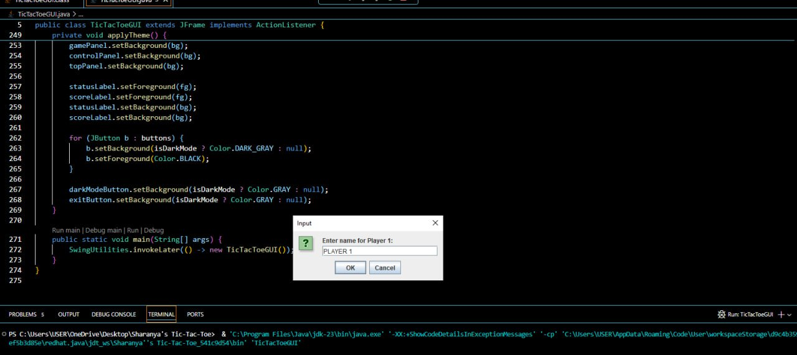
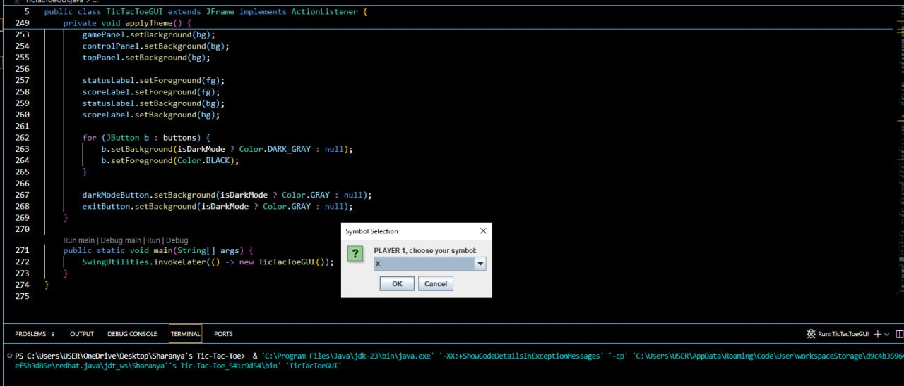
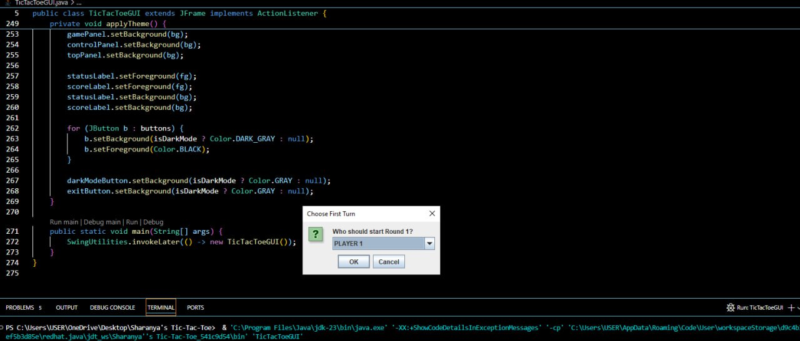
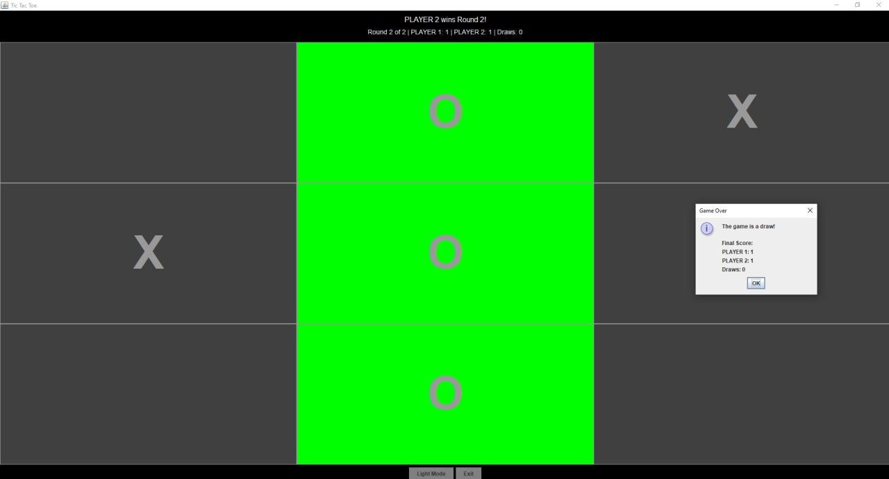

# 🎮 Tic Tac Toe - Java Swing GUI

A fully featured **Tic Tac Toe game** built with **Java Swing**, allowing two players to play multiple rounds with name, symbol, and theme customization.

---





## 🖥️ Features

- 🎨 **Graphical Interface** using Java Swing
- 👥 **Two-player support** with custom name input
- ✏️ Player **symbol selection** (X or O)
- 🔁 **Multiple round system** with score tracking
- 🔄 Ask who starts each round for fairness
- 🌗 **Dark Mode / Light Mode toggle**
- ✅ Win & draw detection with color highlights
- 🧮 Scoreboard tracking:
  - Player wins
  - Draw count
- ❌ Exit button to close the game
- ⏱️ Automatic reset between rounds

---

## 🧰 Tech Stack

- Language: **Java**
- GUI: **Java Swing**
- IDE: Recommended: **IntelliJ IDEA**, **Eclipse**, or any Java-supported IDE

---

## 🚀 How to Run

1. **Clone this repository** or copy the code into a `.java` file (e.g. `TicTacToeGUI.java`).

2. Compile and run using your preferred IDE or terminal:

   ```bash
   javac TicTacToeGUI.java
   java TicTacToeGUI
   ```
3. The GUI will launch and prompt you for:
- Player names
- Symbol selection (X or O)
- Number of rounds
- Who starts first each round

## 📝 Notes

- The game ends automatically after the final round.
- The win condition is visually indicated by **green-highlighted winning cells**.
- **Dark mode** affects the entire interface, including buttons and text.

---

## ✨ Future Enhancements (Suggestions)

- 🔊 Add **sound effects** for clicks and win events  
- 🤖 Implement a **single-player mode** with AI  
- 📁 Export **match history or scores** to a file  
- 🎨 Add **theme customization** (colors, fonts)

---

## 🙌 Acknowledgements

Made with ❤️ using **Java Swing**.

---

## 📄 License

This project is licensed under the **MIT License** – feel free to use, modify, and distribute.
